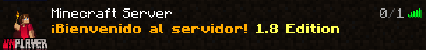
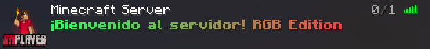

# 🎮 Bungee MOTD Adaptive

Plugin de BungeeCord que detecta automáticamente la versión del cliente Minecraft y muestra MOTDs adaptativos con colores RGB para versiones modernas y tradicionales para 1.8.x

## ✨ Características

- **🔄 Detección Automática**: Detecta automáticamente la versión del cliente Minecraft
- **🎨 MOTDs Adaptativos**: Muestra diferentes MOTDs según la versión del cliente
- **🌈 Colores RGB**: Soporte completo para colores RGB en versiones modernas (1.16.5+)
- **⚡ Compatibilidad Legacy**: MOTDs tradicionales para clientes 1.8.x hasta 1.16.4
- **📝 Configuración Flexible**: Archivo de configuración YAML personalizable
- **🔧 Logging Avanzado**: Sistema de logging robusto y configurable

## 🖼️ Ejemplos Visuales

### MOTD para Clientes Legacy (1.8.x - 1.16.4)

*Clientes 1.8.x hasta 1.16.4 ven colores básicos sin soporte RGB*

### MOTD para Clientes Modernos (1.16.5+)

*Clientes 1.16.5+ ven colores RGB completos y vibrantes*

## 🚀 Instalación

### Requisitos
- **BungeeCord** 1.21+ (recomendado)
- **Java** 8 o superior

### Pasos de Instalación
1. Descarga el archivo `.jar` del plugin
2. Colócalo en la carpeta `plugins/` de tu servidor BungeeCord
3. Reinicia el servidor BungeeCord
4. El plugin se configurará automáticamente

## ⚙️ Configuración

El plugin crea automáticamente un archivo `config.yml` en la carpeta de datos del plugin.

### Configuración Básica
```yaml
# Configuración de MOTDs
motd:
  legacy: "&6&l¡Bienvenido al servidor! &e&l1.8-1.16.4 Edition"
  modern: "&#FF6600&l¡Bienvenido al servidor! &#00FF66&lRGB Edition"

# Configuración de protocolos
protocols:
  legacy_max: 736  # Protocolo máximo para clientes legacy (1.16.4)

# Configuración de logging
logging:
  show_version_info: true  # Mostrar información de versión en consola
  debug: true              # Mostrar información de debug
```

### Códigos de Color Disponibles

#### Colores Básicos
- `&0` = Negro
- `&1` = Azul oscuro
- `&2` = Verde oscuro
- `&3` = Azul verdoso oscuro
- `&4` = Rojo oscuro
- `&5` = Púrpura oscuro
- `&6` = Dorado
- `&7` = Gris claro
- `&8` = Gris oscuro
- `&9` = Azul
- `&a` = Verde
- `&b` = Azul verdoso claro
- `&c` = Rojo claro
- `&d` = Rosa claro
- `&e` = Amarillo
- `&f` = Blanco

#### Colores RGB (1.16.5+)
- `&#RRGGBB` = Color RGB personalizado
- Ejemplo: `&#FF6600` = Naranja

#### Efectos
- `&l` = Negrita
- `&m` = Tachado
- `&n` = Subrayado
- `&o` = Cursiva
- `&k` = Texto aleatorio

## 🔍 Cómo Funciona

### Detección de Versión
El plugin detecta la versión del cliente a través del protocolo de red:
- **Protocolo ≤ 736**: Cliente 1.8.x hasta 1.16.4 (MOTD sin RGB)
- **Protocolo > 736**: Cliente 1.16.5+ (MOTD con RGB)

### MOTDs Adaptativos
- **Clientes Legacy (1.8.x - 1.16.4)**: Reciben MOTDs con colores básicos y efectos
- **Clientes Modernos (1.16.5+)**: Reciben MOTDs con colores RGB completos

## 📊 Comandos

El plugin no incluye comandos adicionales. Funciona automáticamente al recibir pings del servidor.

## 🛠️ Desarrollo

### Compilación
```bash
# Clonar el repositorio
git clone https://github.com/unplayernetwork/bungee-motd-adaptive.git

# Compilar con Maven
mvn clean compile

# Crear JAR
mvn clean package
```

## 🚀 Mejorado con Cursor AI

Este proyecto fue desarrollado y mejorado utilizando **Cursor AI**, la mejor herramienta de desarrollo asistido por inteligencia artificial. Cursor AI ayudó en:

- **🔄 Refactorización del código** y optimización de la estructura
- **🎨 Mejora de la documentación** y ejemplos visuales
- **⚡ Corrección de bugs** y warnings de compilación
- **📝 Generación de código** limpio y mantenible
- **🔧 Optimización de imports** y dependencias

*Cursor AI: El futuro del desarrollo de software*

## 📄 Licencia

Este proyecto está licenciado bajo la Licencia MIT - ver el archivo [LICENSE](LICENSE) para más detalles.

## 📞 Soporte

- **Issues**: [GitHub Issues](https://github.com/unplayernetwork/bungee-motd-adaptive/issues)
- **Discord**: [Unplayer Network](https://discord.gg/unplayernetwork)

---

**⭐ Si te gusta este plugin, ¡déjale una estrella en GitHub!**
